# Documentation Structure - Mermaid Diagram

```mermaid
graph TD
    A[docs/] --> B[Extraction/]
    A --> C[Guides/]
    A --> D[Project/]
    A --> E[Site/]
    A --> F[Tools/]

    %% Extraction subtree
    B --> B1[AUDIO_EXTRACTION_PLAN.md]
    B --> B2[BULK_EXTRACTION_GUIDE.md]
    B --> B3[CATEGORIES_OVERVIEW.md]
    B --> B4[CATEGORY_RELATIONSHIPS.md]
    B --> B5[CFF_EXTRACTION_SUMMARY.md]
    B --> B6[CFF_MODDING_GUIDE.md]
    B --> B7[CFF_QUICK_REFERENCE.md]
    B --> B8[EXTRACTION_SUCCESS.md]
    B --> B9[ICON_CATEGORY_ABBREVIATIONS.md]
    B --> B10[INDEX.md]
    B --> B11[ORGANIZATION_SUMMARY.md]
    B --> B12[README_CFF_MODDING.md]
    B --> B13[TIGANACH_RELOADED_SETUP.md]
    B --> B14[UI_EXTRACTION_SUMMARY.md]
    B --> B15[UI_ICON_EXTRACTION_SOLUTION.md]
    B --> B16[WEAPONS_ARMOR_ICONS_DEEP_DIVE.md]

    %% Guides subtree
    C --> C1[Race_Creation_Guide.md]
    C --> C2[SOUND_SYSTEM_GUIDE.md]
    C --> C3[SPELL_IDS_REFERENCE.md]
    C --> C4[SpellForce_Campaign_System_Guide.md]
    C --> C5[SpellForce_Multiplayer_FreeGame_Guide.md]
    C --> C6[SpellForce_Quest_Campaign_Creation_Guide.md]
    C --> C7[SpellForce_Quest_System_Guide.md]
    C --> C8[SpellForce_Spell_System_Guide.md]

    %% Project subtree
    D --> D1[COMPLETION_REPORT.md]
    D --> D2[ID_MAPPINGS.md]
    D --> D3[IMPLEMENTATION_SUMMARY.md]
    D --> D4[OPTIONAL_ENHANCEMENTS_COMPLETE.md]
    D --> D5[SPELL_ICON_FIX.md]
    D --> D6[lua_sources_overview.md]

    %% Site subtree
    E --> E1[_layouts/]
    E1 --> E11[default.html]
    E --> E2[assets/]
    E2 --> E21[css/]
    E21 --> E211[style.scss]
    E2 --> E22[images/]
    E22 --> E221[banner.jpg]
    E --> E3[img/]
    E3 --> E31[sf_banner.jpg]
    E --> E4[_config.yml]
    E --> E5[index.md]

    %% Tools subtree
    F --> F1[ICON_MAPPER_USAGE.md]
    F --> F2[git-worktrees-with-claude.md]
    F --> F3[zed-project-settings.md]

    %% Styling
    classDef extraction fill:#e1f5fe,stroke:#01579b,stroke-width:2px
    classDef guides fill:#f3e5f5,stroke:#4a148c,stroke-width:2px
    classDef project fill:#e8f5e8,stroke:#1b5e20,stroke-width:2px
    classDef site fill:#fff3e0,stroke:#e65100,stroke-width:2px
    classDef tools fill:#fce4ec,stroke:#880e4f,stroke-width:2px

    class B,B1,B2,B3,B4,B5,B6,B7,B8,B9,B10,B11,B12,B13,B14,B15,B16 extraction
    class C,C1,C2,C3,C4,C5,C6,C7,C8 guides
    class D,D1,D2,D3,D4,D5,D6 project
    class E,E1,E11,E2,E21,E211,E22,E221,E3,E31,E4,E5 site
    class F,F1,F2,F3 tools
```

## Documentation Categories Overview

### 📁 Extraction/ (16 files)
Asset extraction guides, technical documentation for extracting game resources from PAK files, UI assets, icons, and other game data.

### 📁 Guides/ (8 files)
Comprehensive guides for different aspects of SpellForce modding:
- System-specific guides (Quest, Spell, Sound, Campaign systems)
- Creation guides (Race creation, multiplayer setup)
- Reference materials (Spell IDs, etc.)

### 📁 Project/ (6 files)
Internal project documentation including completion reports, implementation summaries, and technical details.

### 📁 Site/ (Jekyll website)
GitHub Pages website structure with layouts, assets, and content for the documentation site.

### 📁 Tools/ (3 files)
Usage guides for specific tools and development workflows.

## Key Relationships

- **Extraction docs** provide the foundation for understanding game assets
- **Guides** build on extraction knowledge to teach modding techniques
- **Project docs** track internal development progress
- **Site** publishes guides and documentation for public access
- **Tools** provide practical usage instructions for the developed tools

## Maintenance Notes

- **Extraction/**: Updated when new extraction methods are developed
- **Guides/**: Expanded as new modding techniques are discovered
- **Project/**: Updated with development milestones and technical findings
- **Site/**: Synchronized with guides for public documentation
- **Tools/**: Updated when new tools are created or existing ones modified