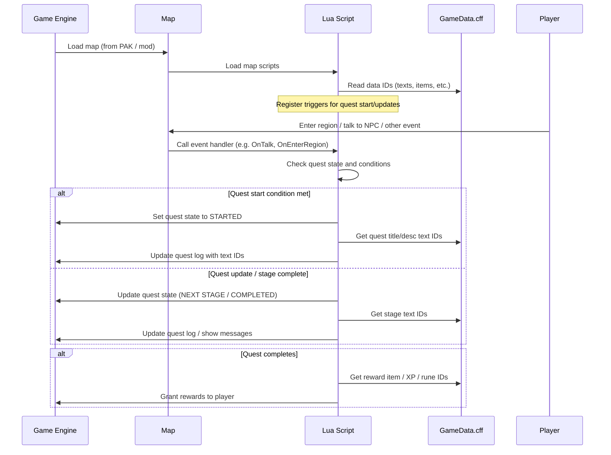
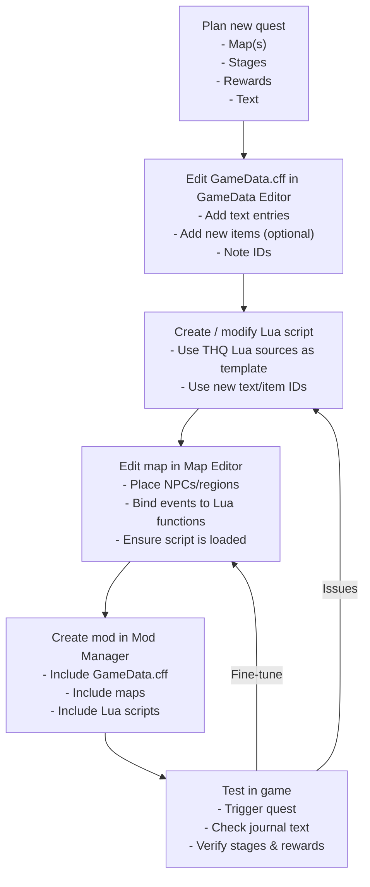

# SpellForce 1 – Quest Modding Overview

This document summarizes how the original SpellForce (Platinum Edition) handles quests, and describes a practical workflow for adding new quests using Lua scripts, maps, and `GameData.cff`.

---

## High‑Level Architecture

SpellForce’s quest system is spread over three main layers:

- **Lua scripts (inside PAKs / mods)**  
  Control quest logic: triggers, conditions, state changes, rewards, journal updates, etc.

- **Maps (campaign / free maps)**  
  Hold NPCs, regions, chests, triggers, and references to Lua functions that implement quest behaviour.

- **`GameData.cff` (main database)**  
  Contains shared data referenced by scripts and maps: text entries (journal + dialogue), items, units, spells, races, etc.

Conceptually:

> Map loads → Map’s Lua script runs → Script uses data IDs from `GameData.cff` → Quest logic executes and pushes updates to the player.

---

## Tools Involved

- **SpellForce Editor (spellforce_data_editor)**
  - **GameData Editor** – edits `GameData.cff` (text, items, units, etc.).
  - **Map Editor** – edits maps, entities, and script bindings.
  - **Mod Manager / Mod Creator** – builds and switches between mods (custom PAKs + custom `GameData.cff`).
  - **SQL Modifier & Lua Decompiler** – helps edit Lua scripts (and decompile old compiled Lua if needed).

- **THQNordic/SpellForceLUASources** (GitHub)
  - Contains original Lua sources for ToD, BoW, SotP.
  - Ideal reference for how existing quests are structured.

- **PAK extraction tools (e.g. Dragon UnPacker)**
  - Alternative way to inspect or extract assets from original PAKs.

---

## How Quests Are Structured

### 1. Lua Scripts

Typical responsibilities:

- **Define quest state** (e.g. constants or tables for stages).
- **Register triggers / hooks** when map loads:
  - Player entering region X.
  - Talking to NPC Y.
  - Killing monster Z.
- **Update journal / UI** using text IDs from `GameData.cff`.
- **Grant rewards** (items, XP, runes) using database IDs.

Existing campaign scripts provide templates for:

- Starting a quest when entering a new map.
- Continuing an existing quest across multiple maps.
- Multi‑step objectives with branching dialogue.

### 2. Maps

Maps:

- Place NPCs, regions, chests, triggers, etc.
- Assign **script events** to entities (e.g. “onTalk → function `Quest_X_NPC_Intro()`”).
- Define which Lua files are loaded for that map.

The Map Editor can usually open official campaign maps and let you:

- Add new regions (for area triggers).
- Place new NPCs or modify existing ones.
- Attach script function names to those entities.

### 3. `GameData.cff`

`GameData.cff` is a large, structured database. For quests, you mainly care about:

- **Text tables**
  - Quest log titles and descriptions.
  - Dialogue lines.
  - Item / NPC names (if you add new ones).

- **Item / unit / spell tables** (only if your quest introduces new content):
  - New reward items (equipment, consumables, etc.).
  - New runes or spells given as rewards.

Lua scripts and maps refer to entries by **ID**, not by string. The workflow is usually:

1. Create or edit text / items in GameData Editor.  
2. Note the assigned IDs.  
3. Use those IDs inside Lua (and sometimes map properties).

---

## Practical Workflow: Adding a New Quest

Below is a generic, engine‑friendly workflow for adding a new quest without breaking the game.

### Step 1 – Plan the Quest

Decide:

- **Map(s)** where the quest starts and progresses.
- **Entry condition** (talk to NPC, enter region, pick up item, etc.).
- **Stages** with clear objectives.
- **Rewards** (existing or new items / XP / runes).
- **Journal text** (title, description per stage).

### Step 2 – Prepare Text and Data in `GameData.cff`

Using **GameData Editor**:

1. **Open the base `GameData.cff`** (usually from your SpellForce installation).
2. In the **text / journal tables**:
   - Add entries for the quest title, descriptions for each stage, and completion text.
   - Optionally add dialogue lines if they are stored here.
3. If you need **new items / entities**:
   - Add them in the relevant tables (items, runes, etc.).
4. **Write down the IDs** of all new entries you created (journal, text, items, etc.).
5. Save as a **modded `GameData.cff`**, not overwriting your original backup.

### Step 3 – Create / Modify the Lua Script

Using the **THQNordic Lua sources** as reference:

1. Pick a **simple existing quest** that’s similar to what you want.
2. Copy its script (or relevant functions) into your mod’s script file.
3. Adjust:
   - Trigger registration (which events start / update the quest).
   - Conditions (e.g. check for item possession, kill counts, region flags).
   - Rewards (using the IDs prepared in `GameData.cff`).
   - Journal updates: swap text IDs with your new ones.
4. Ensure your script exposes functions the map will call, e.g.:
   - `Quest_MyQuest_OnTalk_NPC()`
   - `Quest_MyQuest_OnEnterRegion()`

If needed, use **SQL Modifier / Lua decompiler** to inspect how original compiled scripts do it.

### Step 4 – Wire the Quest into the Map

Using **Map Editor** from SpellForce Editor:

1. Open the **target map**.
2. Place or select the **quest giver NPC**, chest, region, or trigger.
3. In the entity’s properties:
   - Assign the appropriate **script function name** for events (e.g. OnTalk → `Quest_MyQuest_OnTalk_NPC`).
4. Make sure the **Lua script file** you created is loaded by this map (follow the pattern from existing map scripts).
5. Add any regions (for area triggers) or helper entities (e.g. spawn points) the quest requires.
6. Save the map into your mod workspace.

### Step 5 – Package as a Mod

Using **Mod Manager / Mod Creator**:

1. Create a **new mod project**.
2. Add to it:
   - Your **modified `GameData.cff`** (or merged variant).
   - Your **new/modified map(s)**.
   - Your **Lua script files**.
3. Let Mod Creator build the mod into the appropriate structure (PAKs + config).
4. Activate the mod in **Mod Manager** so it overrides / extends the base game.

### Step 6 – Test In‑Game

1. Launch SpellForce with the mod enabled.
2. Load a save or start the campaign where the map is reachable.
3. Verify:
   - Quest triggers at the correct time.
   - Journal text appears correctly (IDs wired properly).
   - Objectives update as expected.
   - Rewards are granted and usable.
4. Watch for crashes or missing‑text placeholders, which often indicate:
   - Invalid or missing IDs in `GameData.cff`.
   - Script function names not matching what the map expects.

---

## Mermaid – High‑Level Quest Flow

This diagram shows the lifetime of a quest from game load to completion.

---

## Mermaid – Modding Workflow Overview

This diagram focuses on the *modder’s* workflow rather than the runtime behaviour.

---

## Notes and Pitfalls

- **Back up originals** of `GameData.cff` and campaign maps before editing.
- `GameData.cff` is sensitive: adding data is generally safe when done via GameData Editor, but manual edits or corrupt structures will crash the game.
- Keep script function names and map bindings consistent – most silent failures come from typos.
- Start by cloning a **very simple existing quest** and modifying it; avoid inventing patterns that the engine has never used.

This file is meant as a living document – you can extend it with concrete examples (specific maps, quest IDs, script file names) as your project grows.
