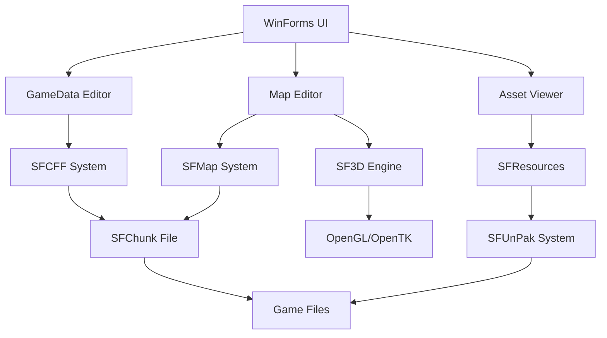

# Architecture Overview

This document provides a comprehensive overview of the SpellForce Data Editor architecture, suitable for developers who want to understand the system deeply.

## Table of Contents

1. [System Architecture](#system-architecture)
2. [Component Diagram](#component-diagram)
3. [Data Flow](#data-flow)
4. [Core Subsystems](#core-subsystems)
5. [Design Patterns](#design-patterns)
6. [Technology Choices](#technology-choices)

## System Architecture

The editor follows a **layered architecture** with clear separation of concerns:

```
┌─────────────────────────────────────────────────────────────┐
│                    Presentation Layer                        │
│  ┌──────────────────┬──────────────────┬─────────────────┐ │
│  │ Game Data Editor │   Map Editor     │  Asset Viewer   │ │
│  │  (WinForms UI)   │   (WinForms UI)  │  (WinForms UI)  │ │
│  └──────────────────┴──────────────────┴─────────────────┘ │
└─────────────────────────────────────────────────────────────┘
                              ▼
┌─────────────────────────────────────────────────────────────┐
│                      Business Logic Layer                   │
│  ┌──────────────────┬──────────────────┬─────────────────┐ │
│  │   SFCFF System   │    SFMap System  │   SFLua System  │ │
│  │  (GameData.cff)  │   (Map Editing)  │ (Decompilation) │ │
│  └──────────────────┴──────────────────┴─────────────────┘ │
└─────────────────────────────────────────────────────────────┘
                              ▼
┌─────────────────────────────────────────────────────────────┐
│                       Core Engine Layer                      │
│  ┌──────────────────┬──────────────────┬─────────────────┐ │
│  │  SFChunk System │   SFUnPak System │ SFResource Mgr  │ │
│  │  (Binary Parser) │  (Archive I/O)   │  (Asset Cache)  │ │
│  └──────────────────┴──────────────────┴─────────────────┘ │
└─────────────────────────────────────────────────────────────┘
                              ▼
┌─────────────────────────────────────────────────────────────┐
│                      Infrastructure Layer                    │
│  ┌──────────────────┬──────────────────┬─────────────────┐ │
│  │   SF3D Engine    │   LogUtils       │  Utility        │ │
│  │  (OpenGL/3D)      │   (Logging)      │  (Helpers)      │ │
│  └──────────────────┴──────────────────┴─────────────────┘ │
└─────────────────────────────────────────────────────────────┘
```

## Component Diagram

### Major Components



### Component Relationships

| Component | Depends On | Provides To |
|-----------|------------|-------------|
| SFCFF | SFChunk | Game Data Editor, SFMap (for lookups) |
| SFMap | SFChunk, SF3D | Map Editor |
| SF3D | OpenGL | Map Editor, Asset Viewer |
| SFLua | - | Script Editor |
| SFUnPak | - | SFResources, all components |
| SFResources | SFUnPak | All components |

## Data Flow

### Loading GameData.cff

```
┌──────────────┐
│ User selects │
│GameData.cff  │
└──────┬───────┘
       ▼
┌─────────────────────────────────────┐
│ SFGameDataNew.Load(filename)        │
└──────┬──────────────────────────────┘
       ▼
┌─────────────────────────────────────┐
│ SFChunkFile.OpenFile(filename)      │
│ - Read header                        │
│ - Build chunk lookup table           │
└──────┬──────────────────────────────┘
       ▼
┌─────────────────────────────────────┐
│ For each category:                   │
│   category.Load(chunkFile)           │
│   - Find chunk by ID                 │
│   - Memory-map data                  │
│   - Parse to struct array            │
└──────┬──────────────────────────────┘
       ▼
┌─────────────────────────────────────┐
│ SFCategoryManager.Set(gamedata)      │
│ - Build lookup caches                │
│ - Register callbacks                 │
└──────┬──────────────────────────────┘
       ▼
┌─────────────────────────────────────┐
│ UI displays data                     │
└─────────────────────────────────────┘
```

### Editing Data with Undo/Redo

```
┌──────────────┐
│ User edits   │
│   field      │
└──────┬───────┘
       ▼
┌─────────────────────────────────────┐
│ UI calls category.SetField()         │
└──────┬──────────────────────────────┘
       ▼
┌─────────────────────────────────────┐
│ Create UndoRedoElementSetField       │
│ - Capture current value              │
│ - Apply new value                    │
└──────┬──────────────────────────────┘
       ▼
┌─────────────────────────────────────┐
│ UndoRedoQueue.Push(command)         │
└──────┬──────────────────────────────┘
       ▼
┌─────────────────────────────────────┐
│ Category.OnElementModified callback │
│ - UI refresh                         │
└─────────────────────────────────────┘
```

### 3D Rendering Pipeline

```
┌──────────────┐
│ SFMap.Load() │
└──────┬───────┘
       ▼
┌─────────────────────────────────────┐
│ Create scene nodes:                  │
│ - Terrain mesh (from heightmap)      │
│ - Building models                    │
│ - Unit models                        │
│ - Object models                      │
└──────┬──────────────────────────────┘
       ▼
┌─────────────────────────────────────┐
│ SFRenderEngine.scene.RootNode        │
│ (Scene graph)                        │
└──────┬──────────────────────────────┘
       ▼
┌─────────────────────────────────────┐
│ Each frame:                          │
│ 1. Update camera                     │
│ 2. Cull non-visible nodes            │
│ 3. Sort by material                  │
│ 4. Render batches                    │
└──────┬──────────────────────────────┘
       ▼
┌─────────────────────────────────────┐
│ OpenGL renders to framebuffer        │
└──────┬──────────────────────────────┘
       ▼
┌──────────────┐
│ Display on   │
│  screen      │
└──────────────┘
```

## Core Subsystems

### 1. SFCFF (GameData.cff) System

**Purpose**: Parse, edit, and save the master game database

**Key Classes**:
- `SFGameDataNew` - Container for all categories
- `ICategory` - Category interface
- `CategoryBaseSingle<T>` - Base for one-to-one categories
- `CategoryBaseMultiple<T>` - Base for one-to-many categories
- `SFCategoryManager` - High-level API

**Data Flow**:
```
Binary File → SFChunkFile → Category → Struct Array → UI
```

### 2. SFMap System

**Purpose**: Load, edit, and render game maps

**Key Classes**:
- `SFMap` - Map container
- `SFMapHeightMap` - Terrain elevation
- `SFMapBuildingManager` - Building placement
- `SFMapUnitManager` - Unit placement
- `SFMapObjectManager` - Interactive objects

**Data Flow**:
```
.map File → SFChunkFile → SFMap → 3D Scene → OpenGL
```

### 3. SF3D Engine

**Purpose**: 3D rendering using OpenGL

**Key Classes**:
- `SFRenderEngine` - Rendering pipeline
- `SFScene` - Scene graph
- `SFModel3D` - 3D model
- `SFMaterial` - Material properties
- `SFShader` - GLSL shaders

**Rendering Passes**:
1. Shadow map generation
2. Scene rendering (geometry + lighting)
3. Screen-space effects
4. UI rendering

### 4. SFUnPak System

**Purpose**: Extract files from PAK archives

**Key Classes**:
- `SFUnPak` - PAK manager
- `SFPakMap` - File location cache
- `SFPakFileSystem` - Virtual filesystem

**Archive Structure**:
```
PAK File
├── File Entry 1 (offset, size, compressed)
├── File Entry 2
└── ...
```

### 5. SFLua System

**Purpose**: Decompile Lua 4.01 bytecode

**Key Classes**:
- `Decompiler` - Bytecode to AST
- `LuaBinaryFunction` - Bytecode container
- `Chunk` - AST node
- `Node` - AST element

**Decompilation Flow**:
```
Bytecode → Parse Instructions → Build AST → Generate Source
```

## Design Patterns

### 1. Interface-Based Design

All categories implement `ICategory`:
- Enables polymorphism
- Simplifies testing
- Allows extension

### 2. Generic Programming

Base classes use generics for code reuse:
- `CategoryBaseSingle<T>` - Eliminates duplicate code
- Type-safe operations
- Compile-time optimization

### 3. Command Pattern (Undo/Redo)

```csharp
interface IUndoRedo
{
    bool Init();  // Execute and validate
    void Undo();
    void Redo();
}
```

### 4. Manager Pattern

Each major subsystem has a manager:
- `SFCategoryManager` - Game data lookups
- `SFResourceManager` - Asset caching
- `SFPakMap` - Archive index

### 5. Observer Pattern

Categories fire callbacks on modification:
```csharp
category.SetOnElementModifiedCallback((catID, index) => {
    // Refresh UI
});
```

### 6. Factory Pattern

Resources are created through containers:
```csharp
SFResourceManager.Models.Get(meshName);
```

## Technology Choices

### Why WinForms?

- **Rapid development** - Native Windows controls
- **Familiarity** - Well-established framework
- **Sufficient** - Meets UI requirements
- **Stability** - Mature and reliable

### Why OpenTK/OpenGL?

- **Cross-platform potential** - OpenGL is portable
- **Performance** - Direct GPU access
- **Control** - Fine-grained rendering control
- **Compatibility** - Works with older hardware

### Why Unsafe Code?

- **Performance** - Direct memory access
- **Binary compatibility** - Match game file format exactly
- **Zero-copy I/O** - Memory-mapped files

### Why Structs for Data?

- **Memory efficiency** - Value types, no heap allocation
- **Cache locality** - Contiguous memory layout
- **Binary compatibility** - Precise memory layout

## Memory Management

### Resource Ownership

- **Models**: Owned by `SFResourceManager.Models`
- **Textures**: Owned by `SFResourceManager.Textures`
- **Maps**: Owned by map editor form
- **Categories**: Owned by `SFGameDataNew`

### Disposal

```csharp
// Automatic disposal
using (var chunk = file.GetChunkByID(id)) {
    // Use chunk
} // Automatically disposed

// Manual disposal
SFResourceManager.DisposeAll();
```

### Memory Profiling

```csharp
LogUtils.Log.TotalMemoryUsage();
SFResourceManager.LogMemoryUsage();
```

## Performance Characteristics

### Load Times

- **GameData.cff**: ~500ms (50 categories, 50K items)
- **Map**: ~2-5s (depending on size)
- **3D Model**: ~50ms average

### Memory Usage

- **GameData.cff**: ~50MB loaded
- **Large Map**: ~200MB
- **3D Scene**: ~100MB+ (cached)

### Optimization Techniques

1. **Zero-copy I/O** - Memory-mapped files
2. **Binary search** - O(log n) lookups
3. **Lazy loading** - Resources loaded on demand
4. **Caching** - Frequently accessed data
5. **Unsafe code** - Hot path optimization

## Concurrency

### Current State

- **Single-threaded** - No parallel processing
- **UI thread** - All operations on main thread

### Future Improvements

- Async file I/O
- Parallel category loading
- Background texture loading

## Extensibility Points

### Adding New Categories

See [Development Guide - Adding Features](../development/adding-features.md)

### Adding New Map Features

1. Create manager in `SFMap/`
2. Add chunk handling
3. Create UI control

### Adding New Render Effects

1. Add shader to `SF3D/SFRender/shaders/`
2. Create render pass in `SFRenderEngine`
3. Add material properties

## Next Steps

- [Category System Details](categories.md) - Deep dive into SFCFF
- [3D Engine Details](3d-engine.md) - OpenGL rendering pipeline
- [Lua System Details](lua-system.md) - Decompilation architecture
- [File Format Specs](../formats/README.md) - Binary format documentation

---

**For implementation details**, see the [Development Guide](../development/README.md).
