# SpellForce GameData Category Relationships

**Generated:** 2025-10-18

This document visualizes the relationships between categories in the GameData.cff file.

---

## Relationship Diagram (Mermaid)

```mermaid
graph TD
    %% Central Text Database
    C2016[2016: Text Data<br/>MULTILINGUAL DATABASE]

    %% Items System
    C2003[2003: Item General Info<br/>CORE ITEM TABLE]
    C2004[2004: Item Armor/Stats]
    C2012[2012: Item UI Data]
    C2013[2013: Spell Scroll Link]
    C2014[2014: Item Weapon Effects]
    C2015[2015: Item Weapon Data<br/>WEAPONS]
    C2017[2017: Item Skill Requirements]
    C2018[2018: Installed Scroll Link]

    %% Weapon Lookups
    C2063[2063: Weapon Types<br/>LOOKUP]
    C2064[2064: Weapon Materials<br/>LOOKUP]

    %% Spells
    C2002[2002: Spell Data<br/>CORE SPELLS]
    C2054[2054: Spell Lines]
    C2056[2056: Spell Requirements]

    %% Units
    C2024[2024: Unit General Data<br/>CORE UNITS]
    C2005[2005: Unit/Hero Stats]
    C2006[2006: Hero/Worker Skills]
    C2025[2025: Unit Equipment]
    C2026[2026: Unit Spells]
    C2067[2067: Unit AI/Behavior]

    %% Buildings
    C2029[2029: Building Data<br/>CORE BUILDINGS]
    C2030[2030: Building Collision]
    C2031[2031: Building Resource Costs]
    C2032[2032: Building Upgrades]

    %% Army Units
    C2001[2001: Army Unit Building Req]
    C2028[2028: Army Unit Resource Req]

    %% Races & Factions
    C2022[2022: Race Stats]
    C2023[2023: Faction Relations]

    %% Skills
    C2039[2039: Skills]

    %% Merchants
    C2041[2041: Merchants]
    C2042[2042: Merchant Inventory]

    %% ========================================
    %% ITEM SYSTEM RELATIONSHIPS
    %% ========================================

    C2003 -->|NameID| C2016
    C2003 -->|UnitStatsID| C2005
    C2003 -->|BuildingID| C2029

    C2004 -->|ItemID| C2003
    C2012 -.->|ItemID| C2003
    C2013 -->|ItemID| C2003
    C2013 -->|InstalledScrollItemID| C2003
    C2014 -.->|ItemID| C2003
    C2014 -->|EffectID| C2002
    C2015 -->|ItemID| C2003
    C2015 -->|WeaponType| C2063
    C2015 -->|WeaponMaterial| C2064
    C2017 -.->|ItemID| C2003
    C2017 -->|Skill| C2039
    C2018 -->|SpellItemID| C2003
    C2018 -->|EffectID| C2002

    C2063 -->|NameID| C2016
    C2064 -->|NameID| C2016

    %% ========================================
    %% SPELL SYSTEM RELATIONSHIPS
    %% ========================================

    C2002 -->|SpellLineID| C2054
    C2054 -->|TextID| C2016
    C2056 -.->|SpellID| C2002

    %% ========================================
    %% UNIT SYSTEM RELATIONSHIPS
    %% ========================================

    C2024 -->|NameID| C2016
    C2024 -->|StatsID| C2005

    C2005 -->|UnitRace| C2022
    C2006 -.->|UnitStatsID| C2005
    C2006 -->|Skill| C2039
    C2025 -.->|UnitID| C2024
    C2025 -->|ItemID| C2003
    C2026 -.->|UnitID| C2024
    C2026 -->|SpellID| C2002
    C2067 -.->|UnitID| C2024

    %% ========================================
    %% BUILDING SYSTEM RELATIONSHIPS
    %% ========================================

    C2029 -->|NameID| C2016
    C2029 -->|DescriptionID| C2016
    C2029 -->|RaceID| C2022
    C2030 -.->|BuildingID| C2029
    C2031 -.->|BuildingID| C2029
    C2032 -.->|BuildingID| C2029

    %% ========================================
    %% ARMY UNIT REQUIREMENTS
    %% ========================================

    C2001 -.->|ArmyUnitID| ARMY_UNITS
    C2001 -->|BuildingID| C2029
    C2028 -.->|ArmyUnitID| ARMY_UNITS

    %% ========================================
    %% RACE SYSTEM
    %% ========================================

    C2022 -->|TextID| C2016
    C2023 -.->|ClanID pairs| C2022

    %% ========================================
    %% MERCHANT SYSTEM
    %% ========================================

    C2041 -.->|MerchantID| MERCHANTS
    C2042 -.->|MerchantID| C2041
    C2042 -->|ItemID| C2003

    %% ========================================
    %% SKILL SYSTEM
    %% ========================================

    C2039 -->|NameID| C2016

    %% ========================================
    %% VIRTUAL NODES
    %% ========================================

    ARMY_UNITS[Army Units<br/>Implicit Table]
    MERCHANTS[Merchants<br/>Category 2041]

    %% ========================================
    %% STYLING
    %% ========================================

    classDef coreTable fill:#ff6b6b,stroke:#c92a2a,stroke-width:3px,color:#fff
    classDef lookupTable fill:#4ecdc4,stroke:#0a8a7f,stroke-width:2px,color:#fff
    classDef multiTable fill:#ffe66d,stroke:#f59e0b,stroke-width:2px,color:#000
    classDef textDB fill:#a8e6cf,stroke:#56ab91,stroke-width:4px,color:#000
    classDef virtualNode fill:#ddd,stroke:#999,stroke-width:1px,stroke-dasharray: 5 5,color:#333

    class C2003,C2002,C2024,C2029,C2005 coreTable
    class C2063,C2064,C2039,C2054 lookupTable
    class C2004,C2012,C2014,C2017,C2025,C2026,C2030,C2031,C2006 multiTable
    class C2016 textDB
    class ARMY_UNITS,MERCHANTS virtualNode
```



---

## Legend

### Node Types

- 🔴 **Core Tables** (Red) - Primary entity tables (Items, Units, Buildings, Spells)
- 🔵 **Lookup Tables** (Cyan) - Reference/enumeration tables
- 🟡 **Extension Tables** (Yellow) - One-to-many extension data
- 🟢 **Text Database** (Green) - Central multilingual text storage
- ⚪ **Virtual Nodes** (Gray, Dashed) - Implicit/reference-only tables

### Relationship Types

- **Solid Arrow** (—→) - Direct foreign key reference (one-to-one or one-to-many)
- **Dotted Arrow** (⋯→) - Multi-valued relationship (CategoryBaseMultiple)

---

## Key Relationship Patterns

### 1. Central Text Hub
**Category 2016 (Text Data)** is the most referenced category:
- Almost every category references it for names, descriptions, or UI text
- Multilingual support via LanguageID sub-items
- Critical for export: Must resolve TextID → actual text content

### 2. Item System Hub
**Category 2003 (Item General Info)** is extended by 8+ categories:
- **2004** - Armor/stat bonuses (one-to-one)
- **2012** - UI data (one-to-many)
- **2014** - Weapon effects (one-to-many)
- **2015** - Weapon combat data (one-to-one, **weapons only**)
- **2017** - Skill requirements (one-to-many)

**To export a complete weapon:**
```
Category 2003 (base item)
    ├─> Category 2015 (weapon stats)
    │       ├─> Category 2063 (weapon type name)
    │       │       └─> Category 2016 (type text)
    │       └─> Category 2064 (material name)
    │               └─> Category 2016 (material text)
    ├─> Category 2004 (stat bonuses, optional)
    ├─> Category 2012 (UI icon, optional, multi-valued)
    ├─> Category 2014 (effects, optional, multi-valued)
    │       └─> Category 2002 (spell/effect data)
    ├─> Category 2017 (requirements, optional, multi-valued)
    └─> Category 2016 (item name)
```

### 3. Unit System Hub
**Category 2024 (Unit General Data)** + **Category 2005 (Stats)**:
- **2025** - Equipment (one-to-many) → references **Category 2003**
- **2026** - Spells (one-to-many) → references **Category 2002**
- **2006** - Skills (one-to-many on StatsID)
- **2067** - AI behavior

**To export a complete unit:**
```
Category 2024 (base unit)
    ├─> Category 2005 (detailed stats)
    │       ├─> Category 2022 (race properties)
    │       │       └─> Category 2016 (race name)
    │       └─> Category 2006 (skills, multi-valued)
    │               └─> Category 2039 (skill details)
    │                       └─> Category 2016 (skill names)
    ├─> Category 2025 (equipment, multi-valued)
    │       └─> Category 2003 (item details, recursive...)
    ├─> Category 2026 (spells, multi-valued)
    │       └─> Category 2002 (spell details)
    │               └─> Category 2054 (spell line)
    │                       └─> Category 2016 (spell name)
    └─> Category 2016 (unit name)
```

### 4. Building System
**Category 2029 (Building Data)**:
- **2030** - Collision polygons (one-to-many, **variable-length data**)
- **2031** - Resource costs (one-to-many)
- **2032** - Upgrades

### 5. Cross-System References
- **Items** can reference **Units** (via UnitStatsID - hero runes)
- **Items** can reference **Buildings** (via BuildingID)
- **Items** can reference **Spells** (weapon effects, spell scrolls)
- **Units** can reference **Items** (equipment)
- **Units** can reference **Spells** (abilities)

---

## Circular Dependencies

### Item ← → Unit
- **2003** (Items) → `UnitStatsID` → **2005** (Unit Stats)
- **2025** (Unit Equipment) → `ItemID` → **2003** (Items)

**Resolution:** Handle as a many-to-many relationship. Items can summon units; units can equip items.

### Item → Spell → Item
- **2003** (Items, spell scrolls) → **2018** → **2002** (Spells)
- **2002** (Spells) can summon items or reference items

**Resolution:** Export in dependency order or use two-pass loading.

---

## Import/Export Dependency Order

### For Safe Import (Bottom-Up):
1. **Category 2016** - Text (no dependencies)
2. **Category 2039** - Skills → 2016
3. **Category 2022** - Races → 2016
4. **Category 2023** - Faction Relations → 2022
5. **Category 2063, 2064** - Weapon lookups → 2016
6. **Category 2054** - Spell Lines → 2016
7. **Category 2002** - Spells → 2054, 2016
8. **Category 2005** - Unit Stats → 2022
9. **Category 2006** - Unit Skills → 2005, 2039
10. **Category 2003** - Items → 2005, 2016
11. **Category 2004, 2015, 2012, 2013, 2017, 2018** - Item extensions → 2003, 2063, 2064, 2002
12. **Category 2014** - Item Effects → 2003, 2002
13. **Category 2029** - Buildings → 2016, 2022
14. **Category 2030, 2031, 2032** - Building extensions → 2029
15. **Category 2024** - Units → 2016, 2005
16. **Category 2025, 2026, 2067** - Unit extensions → 2024, 2003, 2002
17. **Category 2001, 2028** - Army requirements → 2029
18. **Category 2041, 2042** - Merchants → 2003

### For Export (Top-Down):
Reverse the above order, or export all at once and let the import process resolve dependencies.

---

## Multi-Valued Relationships Detail

These categories use `CategoryBaseMultiple` and allow multiple sub-items per ID:

| Category | Primary ID | Sub-ID Field | Purpose |
|----------|------------|--------------|---------|
| **2001** | ArmyUnitID | BuildingIndex | Multiple buildings required per army unit |
| **2006** | UnitStatsID | SkillMajorID | Multiple skills per unit |
| **2012** | ItemID | UIIndex | Multiple UI representations per item |
| **2014** | ItemID | EffectIndex | Multiple effects per weapon |
| **2016** | TextID | LanguageID | Multiple languages per text |
| **2017** | ItemID | ReqIndex | Multiple skill requirements per item |
| **2023** | ClanID | ClanID2 | Pairwise faction relations |
| **2025** | UnitID | EquipmentIndex | Multiple items equipped per unit |
| **2026** | UnitID | SpellIndex | Multiple spells per unit |
| **2028** | ArmyUnitID | ResourceType | Multiple resources per army unit |
| **2031** | BuildingID | ResourceID | Multiple resources per building |

**Export Strategy:** Use JSON arrays for multi-valued fields.

---

## Special Cases

### Category 2030 (Building Collision)
- Uses **custom ICategory implementation** (not CategoryBase)
- Has **variable-length coordinate arrays** for polygon vertices
- Cannot use simple struct serialization
- Requires special handling in export/import

### Category 2016 (Text Data)
- **Encoding varies by language:**
  - LanguageID 5 (Russian) → Windows-1251
  - LanguageID 6 (Polish) → Windows-1250
  - Others → Windows-1252
- Must use correct encoding when decoding text content

### Implicit Tables
Some entity types don't have core categories but are referenced:
- **Army Units** - Referenced by 2001, 2028, possibly defined in 2003 or 2024
- **Factions/Clans** - Referenced by 2022, 2023, but no dedicated category

---

## Relationship Summary by System

### Items (9 categories)
Core: 2003 | Extensions: 2004, 2012, 2013, 2014, 2015, 2017, 2018 | Lookups: 2063, 2064

### Spells (3 categories)
Core: 2002 | Extensions: 2056 | Lookups: 2054

### Units (6 categories)
Core: 2024, 2005 | Extensions: 2006, 2025, 2026, 2067

### Buildings (5 categories)
Core: 2029 | Extensions: 2030, 2031, 2032 | Requirements: 2001

### Races (2 categories)
Core: 2022, 2023

### Text (1 category)
Core: 2016 | **Referenced by ALL**

---

**This diagram and documentation provide the foundation for implementing safe import/export with proper foreign key validation and dependency resolution.**
